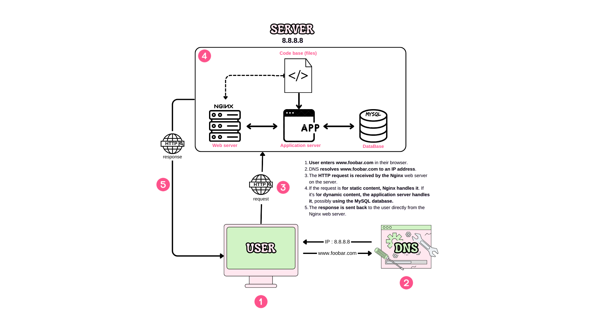
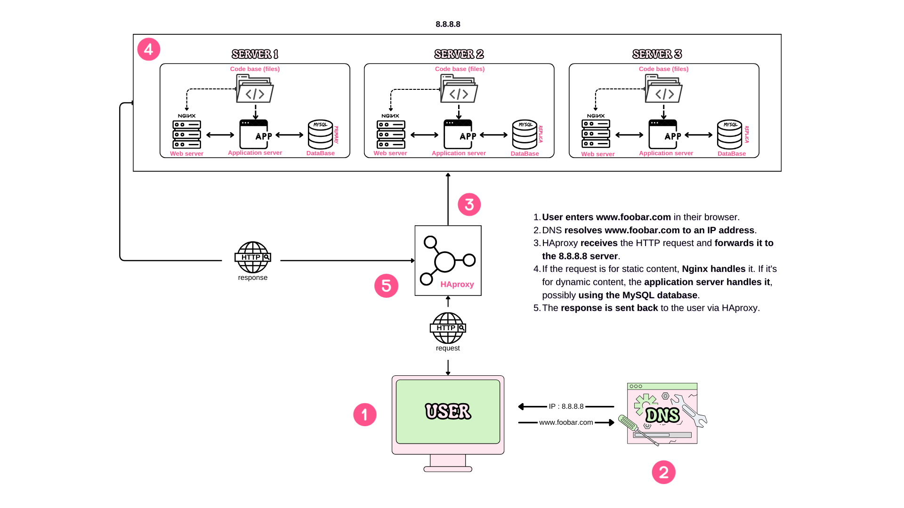
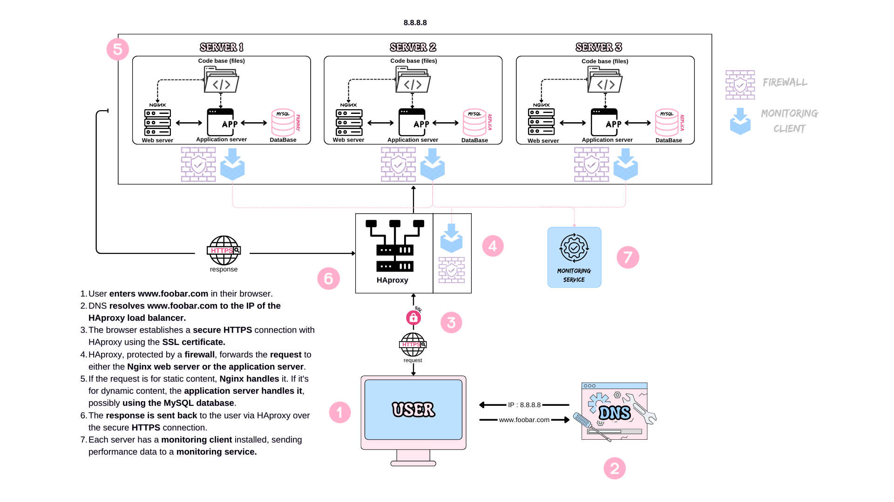
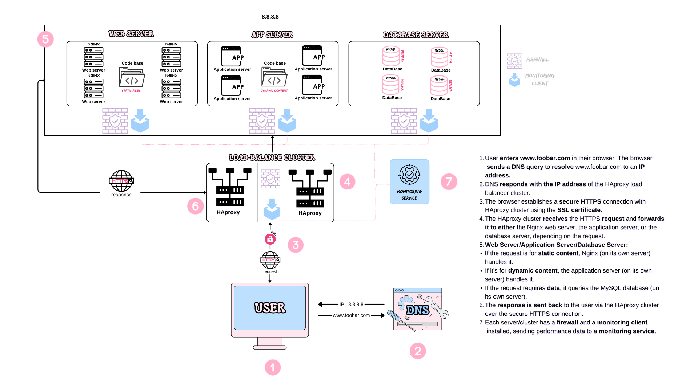

# Web Infrastructure Design Project

This project involves designing a web infrastructure for the website www.foobar.com. The project is divided into four tasks, each requiring a specific infrastructure setup.

## Task 0: Simple Web Infrastructure
Files: 0-simple_web_stack

Design a one server web infrastructure that hosts the website that is reachable via www.foobar.com.

Requirements:

- One server
- One web server (Nginx)
- One application server
- Application files (your code base)
- One database (MySQL)
- A domain name foobar.com configured with a www record that points to your server IP 8.8.8.8

## Task 1: Distributed Web Infrastructure
Files: 1-distributed_web_infrastructure

Design a three server web infrastructure that hosts the website www.foobar.com.

Requirements:
- Two additional servers
- One web server (Nginx)
- One application server
- One load-balancer (HAproxy)
- One set of application files (your code base)
- One database (MySQL)

## Task 2: Secured and Monitored Web Infrastructure
Files: 2-secured_and_monitored_web_infrastructure

Design a three server web infrastructure that hosts the website www.foobar.com, it must be secured, serve encrypted traffic, and be monitored.

Requirements:

- Three firewalls
- One SSL certificate to serve www.foobar.com over HTTPS
- Three monitoring clients (data collector for Sumologic or other monitoring services)

## Task 3: Scale Up
Files: 3-scale_up

Design a three server web infrastructure that hosts the website www.foobar.com, it must be secured, serve encrypted traffic, and be monitored.

Requirements:

- One additional server
- One load-balancer (HAproxy) configured as a cluster with the other one
- Split components (web server, application server, database) onto their own servers

# Author
[L344S](https://github.com/L344S)